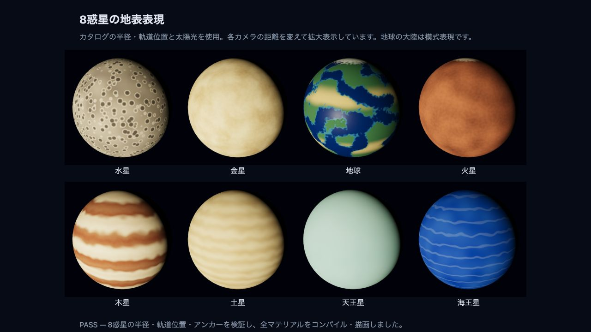

# 惑星の地表表現（#13–#20）

`pnpm dev` を起動し、`http://127.0.0.1:5173/docs/planet-surfaces.html` を開くと、同じ生成関数と太陽光を使った8惑星の拡大比較ができます。この開発用ページは本番ビルドには含めません。

- 水星：既存の灰褐色のクレーター表現を共通ファクトリーから生成。
- 金星：黄白色の雲模様。
- 地球：海、大陸、乾燥帯、両極の氷。大陸形状は3Dノイズによる模式表現。
- 火星：赤褐色の濃淡と極冠。
- 木星：複数の明暗帯。土星：淡い黄褐色の穏やかな縞。
- 天王星：滑らかな淡いシアン。海王星：深い青と薄い雲帯。

メッシュはカタログの表示半径で生成し、各公転アンカーの子として軌道半径の位置に配置します。模様は球面上のローカル座標から計算するため、テクスチャ取得や画像の解放処理は不要です。外惑星でも模様を視認できるよう、地表色に軌道距離の二乗に応じた表示用の露出補正を加えています。測光的な再現ではありません。

本画面では左ドラッグで回転、右ドラッグで平行移動、ホイールでズームできます。外惑星まで届くよう操作範囲と遠クリップを拡大しています。

検証ページは半径・軌道位置・アンカーの一致を検証し、各マテリアルをコンパイルして描画します。ブラウザで PASS と色・模様を確認済みです。`pnpm lint`、`pnpm build` も成功しています。

